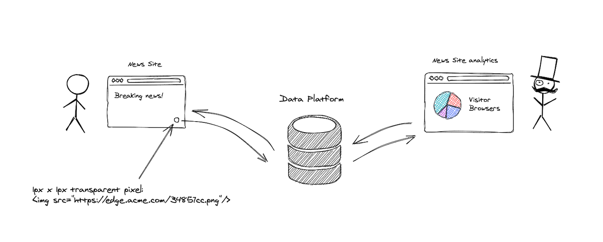
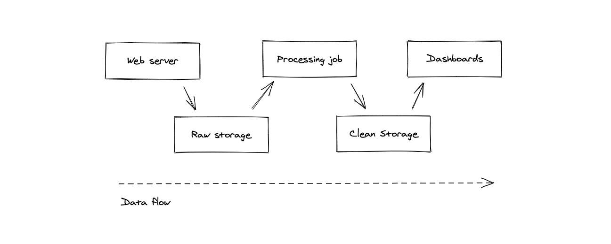
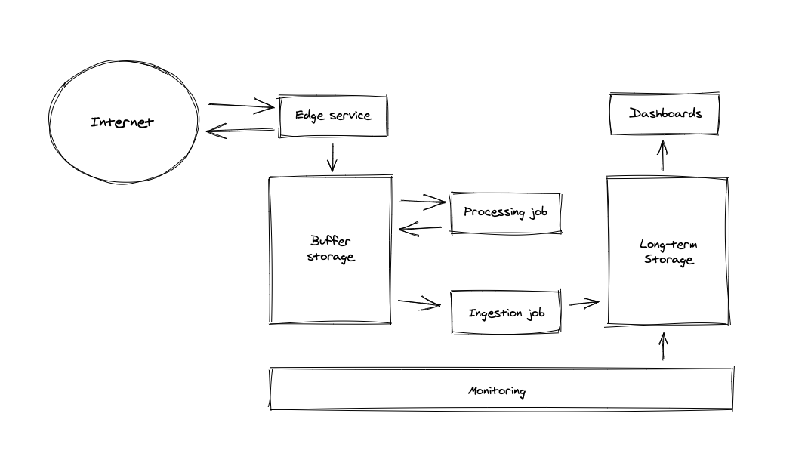

# Intro

In a modern world, [data is a new oil](https://www.forbes.com/sites/forbestechcouncil/2019/11/15/data-is-the-new-oil-and-thats-a-good-thing/?sh=647471ab7304). Data platform design and implementation skill becomes crucial. There are lot of tutorials covering narrow topics related to the data processing, but it's hard to get ten-thousands feet overview. The idea of the tutorial is to provide an idea of how such data platforms could be built. 

But what is a data platform, anyway? 

Well, I took the definition from [Looker](https://looker.com/definitions/data-platform):

> A data platform is an integrated technology solution that allows data located in database(s) to be governed, accessed, and delivered to users, data applications, or other technologies for strategic business purposes.

Right now, there are two approaches to process the data: batch and streaming, in a wider sense also known as [Lambda](https://en.wikipedia.org/wiki/Lambda_architecture) and Kappa architectures (in reality, almost all data platform are hybrids, where batch and stream processing is co-exists).

During this tutorial, I'm going to implement extremely simple (a toy) data platform, trying to cover as much important aspects as possible. I'll define "the problem statement" in a next section. 

Unfotunately, some aspects will not be covered during this tutorial. Most of them related to Enterprise Architecture and not important in our toy data platform. 

Here is very loose list of topics not covered in this tutorial: Security, CI/CD (IaC concept will be covered, though), Data products and Data catalog, [Data lineage](https://en.wikipedia.org/wiki/Data_lineage), [Data governance](https://en.wikipedia.org/wiki/Data_governance).

Shall we start?

# The Problem

TODO: building a startup company

Let's first define problem we want to address. So, here is the simple diagram:

The idea is very simple: the website owner puts HTML `` tag on a website page. When user opens any website page, user's browser automatically makes request to our domain. Our platform stores HTTP request metadata and responds with 1x1 transparent pixel.

Later, using the dashboards data platform provides, website owner can see how many visitors website has and get aggregated insights of user browsers and operating systems.

Simple task, right? Not really.

Let's say our company (which provides analytics and owns data platform), goes planet scale. Here, we entering the world of BigData. Therefore, our platform should be scalable.

# The process

Before going into details of Data Platform architecture, let's first design a scalable dataflow process for our primary goal.

Here is simple process diagram:

So, at the highest level, the process is pretty straightforward:

* Web server receives HTTP request, stores HTTP request metadata in a some raw storage and responds back with 1x1 pixel
* Long-runnig processing job fetch unprocessed requests from a raw storage, parses processes it and write results into clean storage
* Dashboard service queries clean storage and display analytics.

TODO: why we should decouple, and add so much moving parts.

# Architecture overview

# Technology mapping

Here is the list of tools/technologies used in the tutorial:

* [Kubernetes](https://kubernetes.io/)
* [Apache Flink](https://flink.apache.org/) or [Apache Spark](https://spark.apache.org/)
* [Apache Kafka](https://kafka.apache.org/)
* [Apache ZooKeeper](https://zookeeper.apache.org/)
* [Apache Druid](https://druid.apache.org/)
* [Apache Hadoop](http://hadoop.apache.org/)
* [PostgreSQL](https://www.postgresql.org/)
* [Redis](https://redis.io/)
* [Redash](https://redash.io/)
* [Prometheus](https://prometheus.io/)
* [HashiCorp Terraform](https://www.terraform.io/)
* [Helm](https://helm.sh/)
* [Golang](https://golang.org/)
* [Java 11 (AdoptOpenJDK)](https://adoptopenjdk.net/)
* [Apache Maven](https://maven.apache.org/)
* [Docker Desktop](https://www.docker.com/products/docker-desktop)
* [Minikube](https://minikube.sigs.k8s.io/docs/)

As you can see, it's quite big. But don't worry, developer tools installation instructions will be provided later in the tutorial.
