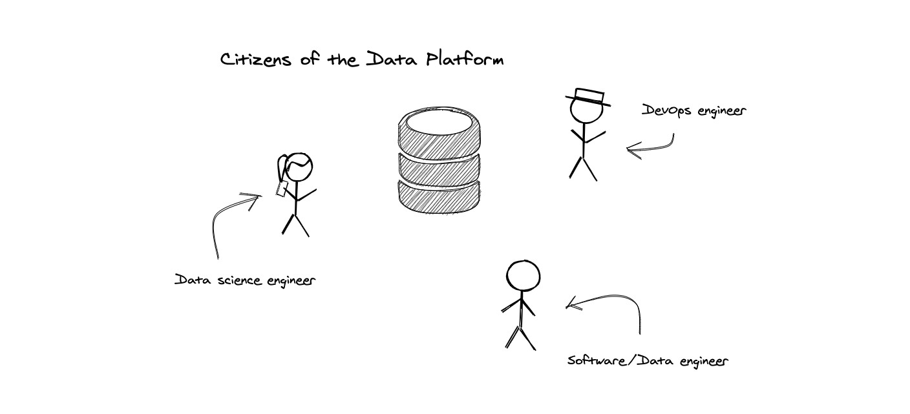

# Intro

In a modern world, [data is a new oil](https://www.forbes.com/sites/forbestechcouncil/2019/11/15/data-is-the-new-oil-and-thats-a-good-thing/?sh=647471ab7304). Data platform design and implementation skill becomes crucial. There are lot of tutorials covering narrow topics related to the data processing, but it's hard to get ten-thousands feet overview. The idea of the tutorial is to provide an idea of how such Data platforms could be built. 

Right now, there are two approaches to process the data: batch and streaming, in a wider sense also known as [Lambda](https://en.wikipedia.org/wiki/Lambda_architecture) and Kappa architectures (in reality, almost all data platform are hybrids, where batch and stream processing is co-exists).

It's basically impossible to cover 360-degree technology view of modern Data platform, just take a look at [technology landscape](https://mattturck.com/data2020/)!

During this tutorial, I'm going to implement extremely simple (a toy) Data platform, trying to cover as much important aspects as possible. I'll define "the problem statement" in a next section. 

Unfotunately, some aspects will not be covered during this tutorial. Most of them related to Enterprise Architecture and not important in our toy Data platform. Here is very loose list of topics not covered in this tutorial: Security, CI/CD (IaC concept will be covered, though), Data products and Data catalog, [Data lineage](https://en.wikipedia.org/wiki/Data_lineage), [Data governance](https://en.wikipedia.org/wiki/Data_governance).

Here is the list of tools/technologies used in the tutorial:

* [Kubernetes](https://kubernetes.io/)
* [Apache Flink](https://flink.apache.org/)
* [Apache Spark](https://spark.apache.org/)
* [Apache Kafka](https://kafka.apache.org/)
* [Apache ZooKeeper](https://zookeeper.apache.org/)
* [Apache Druid](https://druid.apache.org/)
* [Apache Hadoop](http://hadoop.apache.org/)
* [PostgreSQL](https://www.postgresql.org/)
* [Redis](https://redis.io/)
* [Redash](https://redash.io/)
* [Prometheus](https://prometheus.io/)
* [HashiCorp Terraform](https://www.terraform.io/)
* [Helm](https://helm.sh/)
* [Golang](https://golang.org/)
* [Java 11 (AdoptOpenJDK)](https://adoptopenjdk.net/)
* [Apache Maven](https://maven.apache.org/)
* [Docker Desktop](https://www.docker.com/products/docker-desktop)
* [Minikube](https://minikube.sigs.k8s.io/docs/)

As you can see, it's quite big. But don't worry, developer tools installation instructions will be provided later in the tutorial.

Shall we start?

# The Problem

So, we are going to build a "Data Platform". Let's first define problem we want to address. So, here is the simple diagram:

The idea is very simple: the website owner puts HTML `` tag on a website page. When user opens any website page, user's browser automatically makes request to our domain. Our platform stores HTTP request metadata and responds with 1x1 transparent pixel.

Later, using the dashboards data platform provides, website owner can see how many visitors website has and get aggregated insights of user browsers and operating systems.

Simple task, right? Not really.

Let's say our company (which provides analytics and owns data platform), goes planet scale. Here, we entering the world of BigData. Therefore, our platform should be scalable.

Bigger scale, bigger operational problems.

Our platform needs to be reliable, feature packed and it would be awesome to provide data access to data science engineers.

# The process

Before going into details of Data Platform architecture, let's first design a scalable dataflow process for our primary goal.

Here is simple process diagram:

So, on the highest level, the process is pretty straightforward:

* Web server receives pixel request and stores HTTP metadata in some raw storage
* Later processing job comes into play, process the raw storage, parses the request, identifies the browser and operating system out of `User-agent` request header and puts clean metadata to clean storage.
* Finally, dashboard service queries clean storage and display analytics.

Why not parse, validate and put right to the clean storage and avoid having raw storage and processing job? Well, since our pixel is loaded on the page, latency is crucial for our web service, any delays negatively affect the website user experience.

So, to save CPU cycles, minimize latency and make our website user happy, we want to delay any heavy computations during pixel request phase.

Again, we will make techology mapping later, at this point, just overview part.

