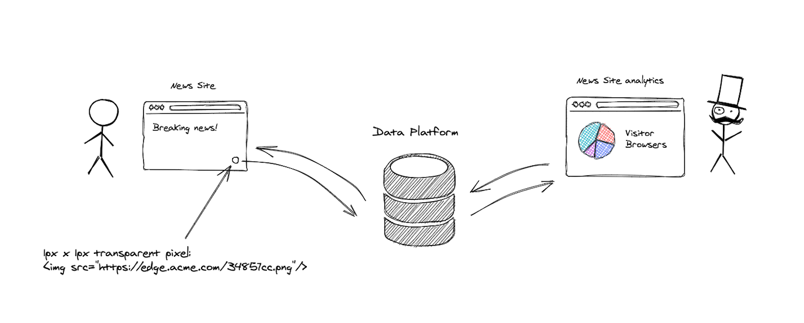
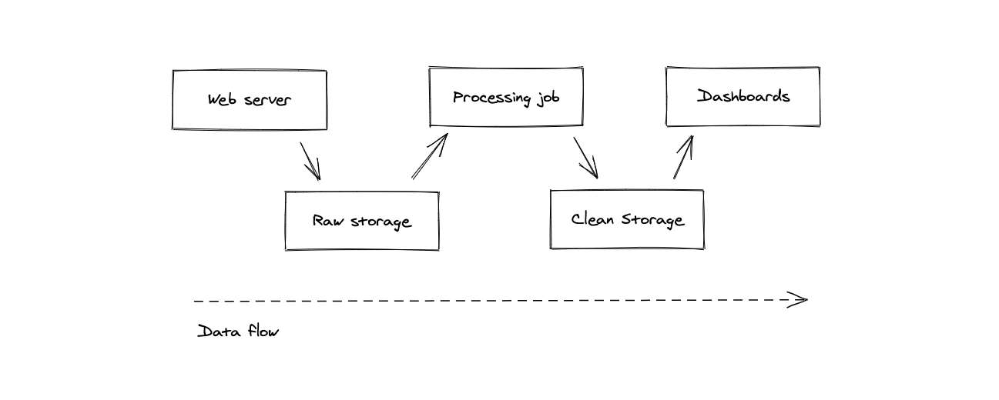
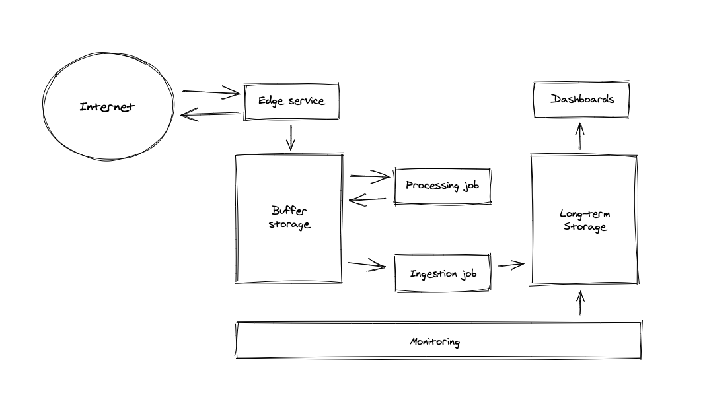

# Intro

TODO: write an intro

# The Problem

TODO: building a startup company

Let's first define problem we want to address. So, here is the simple diagram:

The idea is very simple: the website owner puts HTML `` tag on a website page. When user opens any website page, user's browser automatically makes request to our domain. Our platform stores HTTP request metadata and responds with 1x1 transparent pixel.

Later, using the dashboards data platform provides, website owner can see how many visitors website has and get aggregated insights of user browsers and operating systems.

Simple task, right? Not really.

Let's imagine our company (which provides analytics and owns data platform), goes internet scale. And right here, we entering the world of BigData. Therefore, our whole platform should be scalable. 

# The process

Before going into details of Data Platform architecture, let's first design a scalable dataflow process for our primary goal.

Here is simple process diagram:

So, at the highest level, the process is pretty straightforward:

* Web server receives HTTP request, stores HTTP request metadata in a some raw storage and responds back with 1x1 pixel
* Long-runnig processing job fetches the unprocessed requests from a raw storage, parses them and write results into clean storage
* Dashboard service queries clean storage and display analytics.

TODO: why we should decouple, and add so much moving parts.

# Architecture overview

TODO: name things properly. Split processing job into two jobs: transform job and ingest job (why?)

TODO: why processing job doesn't write directly to long-term storage (why ingestion job is required), what is monitoring?

# Technology mapping

TODO: Redraw architecture with technologies mapping.

# Full technology landscape

Here is the list of tools/technologies used in the tutorial:

* [Kubernetes](https://kubernetes.io/)
* [Apache Flink](https://flink.apache.org/) or [Apache Spark](https://spark.apache.org/)
* [Apache Kafka](https://kafka.apache.org/)
* [Apache ZooKeeper](https://zookeeper.apache.org/)
* [Apache Druid](https://druid.apache.org/)
* [Apache Hadoop](http://hadoop.apache.org/)
* [PostgreSQL](https://www.postgresql.org/)
* [Redis](https://redis.io/)
* [Redash](https://redash.io/)
* [Prometheus](https://prometheus.io/)
* [HashiCorp Terraform](https://www.terraform.io/)
* [Helm](https://helm.sh/)
* [Golang](https://golang.org/)
* [Java 11 (AdoptOpenJDK)](https://adoptopenjdk.net/)
* [Apache Maven](https://maven.apache.org/)
* [Docker Desktop](https://www.docker.com/products/docker-desktop)
* [Minikube](https://minikube.sigs.k8s.io/docs/)

As you can see, it's quite big. But don't worry, developer tools installation instructions will be provided later in the tutorial.
